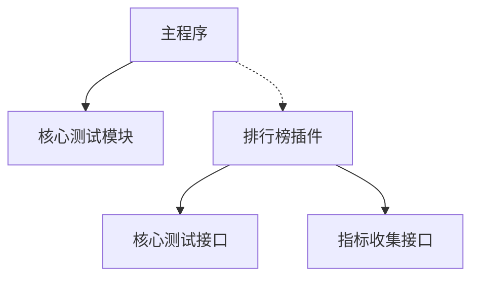

# DeepStressModel 跑分排名功能规划

## 功能概述

跑分排名功能作为DeepStressModel的可选插件模块，提供标准化的性能测试和排行榜功能。该模块采用完全解耦的设计，确保不影响核心测试功能的使用。

## 系统架构

### 插件式设计

```
DeepStressModel
├── core/                         # 核心测试模块
│   ├── tester.py                # 测试核心类
│   └── metrics.py               # 基础指标收集
│
├── plugins/                      # 插件目录
│   └── leaderboard/             # 排行榜插件（可选）
│       ├── __init__.py          # 插件入口
│       ├── auth/                # 设备认证
│       ├── monitor/             # 资源监控
│       ├── api/                 # API客户端
│       ├── ui/                  # 界面组件
│       └── storage/             # 本地存储
│
└── main.py                      # 主程序
```

### 模块依赖关系



## 详细设计

### 1. 插件系统设计

#### 1.1 插件注册机制
```python
class PluginManager:
    """插件管理器"""
    
    def __init__(self):
        self.plugins = {}
        self.hooks = {}
    
    def register_plugin(self, name: str, plugin: Any):
        """注册插件"""
        self.plugins[name] = plugin
        
    def register_hook(self, hook_name: str, callback: Callable):
        """注册钩子函数"""
        if hook_name not in self.hooks:
            self.hooks[hook_name] = []
        self.hooks[hook_name].append(callback)
    
    def trigger_hook(self, hook_name: str, *args, **kwargs):
        """触发钩子函数"""
        if hook_name in self.hooks:
            for callback in self.hooks[hook_name]:
                callback(*args, **kwargs)
```

#### 1.2 排行榜插件入口
```python
class LeaderboardPlugin:
    """排行榜插件"""
    
    def __init__(self, plugin_manager: PluginManager):
        self.plugin_manager = plugin_manager
        self.enabled = False
    
    def initialize(self):
        """初始化插件"""
        # 注册UI组件
        self.plugin_manager.register_hook(
            'ui_init',
            self._init_ui_components
        )
        
        # 注册测试钩子
        self.plugin_manager.register_hook(
            'test_start',
            self._on_test_start
        )
        self.plugin_manager.register_hook(
            'test_complete',
            self._on_test_complete
        )
    
    def enable(self):
        """启用插件"""
        self.enabled = True
        
    def disable(self):
        """禁用插件"""
        self.enabled = False
```

### 2. 核心接口适配

#### 2.1 测试接口适配器
```python
class BenchmarkAdapter:
    """测试适配器"""
    
    def __init__(self, core_tester: CoreTester):
        self.core_tester = core_tester
        self.session = None
    
    async def start_benchmark(self, params: Dict) -> bool:
        """开始基准测试"""
        if not self.session:
            self.session = BenchmarkSession()
            
        # 使用核心测试模块的接口
        test_config = self._convert_params(params)
        return await self.core_tester.start_test(test_config)
    
    def _convert_params(self, benchmark_params: Dict) -> Dict:
        """转换参数格式"""
        return {
            'model': benchmark_params['model'],
            'concurrent': benchmark_params['concurrent_count'],
            'dataset': benchmark_params['dataset_path'],
            'options': benchmark_params.get('options', {})
        }
```

#### 2.2 指标收集适配器
```python
class MetricsAdapter:
    """指标收集适配器"""
    
    def __init__(self, core_metrics: CoreMetrics):
        self.core_metrics = core_metrics
        
    def get_current_metrics(self) -> Dict:
        """获取当前指标"""
        core_data = self.core_metrics.get_metrics()
        return {
            'system': {
                'cpu': core_data['cpu_usage'],
                'memory': core_data['memory_usage'],
                'gpu': core_data['gpu_metrics']
            },
            'performance': {
                'tps': core_data['throughput'],
                'latency': core_data['latency'],
                'concurrent': core_data['active_requests']
            }
        }
```

### 3. 配置管理

#### 3.1 插件配置
```python
@dataclass
class LeaderboardConfig:
    """排行榜配置"""
    enabled: bool = False
    api_endpoint: str = ""
    update_interval: int = 1  # 秒
    metrics_buffer_size: int = 3600  # 1小时的数据点
    local_storage_path: str = "~/.deepstressmodel/leaderboard"
```

#### 3.2 配置存储
```python
class ConfigManager:
    """配置管理器"""
    
    def __init__(self, config_path: str):
        self.config_path = config_path
        self.config = None
    
    def load_config(self) -> LeaderboardConfig:
        """加载配置"""
        if os.path.exists(self.config_path):
            with open(self.config_path, 'r') as f:
                data = yaml.safe_load(f)
                return LeaderboardConfig(**data)
        return LeaderboardConfig()
    
    def save_config(self, config: LeaderboardConfig):
        """保存配置"""
        os.makedirs(os.path.dirname(self.config_path), exist_ok=True)
        with open(self.config_path, 'w') as f:
            yaml.safe_dump(asdict(config), f)
```

### 4. UI组件设计

#### 4.1 组件注册
```python
class LeaderboardUIComponents:
    """排行榜UI组件"""
    
    def __init__(self, main_window: QMainWindow):
        self.main_window = main_window
        self.components = {}
    
    def register(self):
        """注册UI组件"""
        # 添加排行榜标签页
        self.components['tab'] = LeaderboardTab()
        self.main_window.addTab(
            self.components['tab'],
            "排行榜",
            removable=True  # 可移除
        )
        
        # 添加测试选项
        self.components['checkbox'] = QCheckBox("参与跑分排名")
        self.main_window.test_options.addWidget(
            self.components['checkbox']
        )
    
    def unregister(self):
        """注销UI组件"""
        for component in self.components.values():
            component.setParent(None)
        self.components.clear()
```

## 使用方式

### 1. 启用插件
```python
# 主程序中
plugin_manager = PluginManager()
leaderboard_plugin = LeaderboardPlugin(plugin_manager)

# 可选：启用排行榜功能
if config.enable_leaderboard:
    leaderboard_plugin.enable()
```

### 2. 常规测试使用
```python
# 不受排行榜插件影响的常规测试
tester = CoreTester()
await tester.run_test(test_config)
```

### 3. 参与跑分排名
```python
# 启用排行榜后的测试
if leaderboard_plugin.enabled:
    benchmark = BenchmarkAdapter(tester)
    await benchmark.start_benchmark(benchmark_params)
```

## 开发计划

### 第一阶段：框架搭建
1. 实现插件系统
2. 设计核心接口适配器
3. 完成基础配置管理

### 第二阶段：功能实现
1. 开发认证模块
2. 实现指标适配
3. 开发UI组件

### 第三阶段：集成测试
1. 插件加载测试
2. 功能隔离验证
3. 性能影响评估

## 技术依赖

基础依赖（核心模块已有）：
- PyQt6
- aiohttp
- pydantic

插件特定依赖（可选）：
- aiosqlite
- pyyaml
- dataclasses

## 注意事项

1. **代码隔离**
   - 所有排行榜相关代码严格限制在plugins目录
   - 不修改任何核心模块代码
   - 通过接口适配器进行交互

2. **性能影响**
   - 禁用状态下零开销
   - 启用状态下最小化资源占用
   - 异步处理所有网络请求

3. **可维护性**
   - 清晰的模块边界
   - 统一的配置管理
   - 完整的类型注解

4. **用户体验**
   - 平滑的功能切换
   - 清晰的状态提示
   - 直观的配置界面 